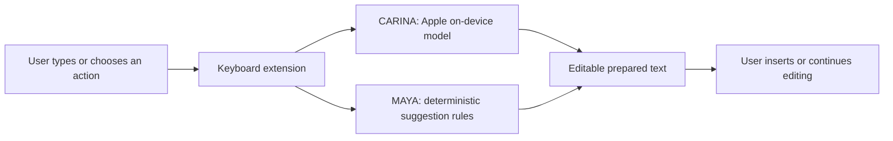

# CARINA x MAYA TYPE

Two privacy-first iOS keyboard experiences built as native Swift projects.

- **CARINA TYPE** uses Apple's on-device Foundation Models on iOS 26 or later for user-requested replies, rewrites, tone changes, shortening, and Spanish translation.
- **MAYA TYPE** provides fast, deterministic suggestions selected from the text the user is currently drafting.

Neither keyboard requests Full Access. Both prepare editable text through `textDocumentProxy`; neither sends messages or places calls.

## What is real today

| Capability | CARINA TYPE | MAYA TYPE |
| --- | --- | --- |
| Native iOS host app and keyboard extension | Yes | Yes |
| Keyboard Full Access required | No | No |
| On-device language-model generation | iOS 26+ with an available Apple system model | No |
| Context-aware prepared replies | Model-generated | Deterministic rules |
| User reviews text before insertion | Yes | Yes |
| Voice screen | Apple Speech recognition and AVSpeechSynthesizer | Apple Speech recognition |

The projects target iOS 18. CARINA's Foundation Models generation and newer visual effects are availability-gated for iOS 26 or later. Speech recognition is provided by Apple and can use Apple speech services.

## Repository map

```text
Apps/CarinaType/     CARINA host app and keyboard extension
Apps/MayaType/       MAYA host app and keyboard extension
Docs/                Architecture, privacy, and verification evidence
Scripts/             Repeatable local checks
.github/agents/      Specialized GitHub Copilot coding agents
.github/workflows/   Continuous integration
```

## Architecture



## Build

Requirements: macOS, Xcode with an iOS simulator SDK, and the Xcode command-line tools.

```bash
./Scripts/verify.sh
```

Or build either project directly:

```bash
xcodebuild -project Apps/CarinaType/PocketType.xcodeproj -scheme PocketType \
  -sdk iphonesimulator -configuration Debug CODE_SIGNING_ALLOWED=NO build

xcodebuild -project Apps/MayaType/PocketType.xcodeproj -scheme PocketType \
  -sdk iphonesimulator -configuration Debug CODE_SIGNING_ALLOWED=NO build
```

## Add a keyboard on iPhone

1. Build and run the host app from Xcode.
2. Open **Settings > General > Keyboard > Keyboards > Add New Keyboard**.
3. Select CARINA TYPE or MAYA TYPE.
4. Use the globe key in any text field to switch keyboards.

Full Access should remain off.

## Agent team

This repository includes four focused custom agents:

- **Build Verifier** — compiles both apps and reports exact failures.
- **Privacy Guard** — protects the no-Full-Access and user-controlled insertion boundaries.
- **Documentation Evidence** — keeps public claims aligned with source code.
- **Release Prep** — validates a release candidate without publishing it automatically.

Project-wide operating rules live in [AGENTS.md](AGENTS.md). See [Docs/PRIVACY.md](Docs/PRIVACY.md) for exact boundaries and [Docs/VERIFICATION.md](Docs/VERIFICATION.md) for reproducible evidence.

## Status

The current source has been compiled for the iOS Simulator and a physical iPhone during development. GitHub Actions repeats unsigned simulator builds for both projects on every pull request and push to `main`.

## License

Copyright (c) 2026 Leandro Fajardo. All rights reserved. See [LICENSE](LICENSE).
